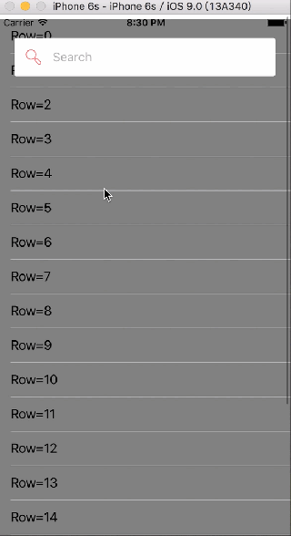
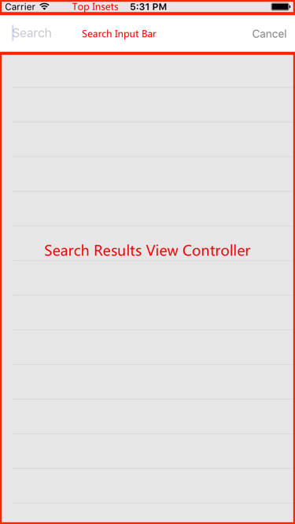
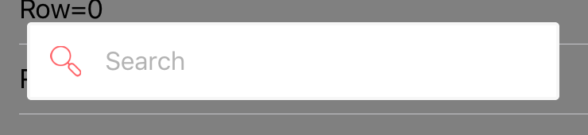
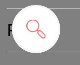

# SYSearchBar
[](https://travis-ci.org/seanyue/SYSearchBar)
[](http://cocoapods.org/pods/SYSearchBar)
[](http://cocoapods.org/pods/SYSearchBar)
[](http://cocoapods.org/pods/SYSearchBar)
## Overview
SYSearchBar is just an AirBnb-like search bar, which implements its own UI logic instead of using the components of `UIKit` such as `UISearchBar`/`UISearchController`(iOS8+)/`UISearchDisplayController`(<iOS8).



## Usage
You can use `SYSearchBar` via `UIViewController`'s category:
```
@interface UIViewController (SYSearchBar) <SYSearchButtonDelegate>

@property (nonatomic,readonly) CGFloat syInputBarTopInsets;

@property (nonatomic,retain,readonly) SYSearchButton *sySearchButton;
@property (nonatomic,retain,readonly) SYSearchInputBar *sySearchInputBar;
@property (nonatomic,retain) UIViewController *sySearchResultsViewController; // Setting your own view controller for results

- (void)syAddSearchBarInPosition:(CGPoint)pos;
- (void)syAddSearchBarInPosition:(CGPoint)pos topInsetsOfInputBar:(CGFloat)topInsets;

@end
```
#### To add a search bar in your view controller
Use the methods below to add a search bar in specified position to your view of the categoried view controller:
```
- (void)syAddSearchBarInPosition:(CGPoint)pos;
- (void)syAddSearchBarInPosition:(CGPoint)pos topInsetsOfInputBar:(CGFloat)topInsets;
```
The `topInsets` specifies the top insets from the search bar to your view's top edge.
The properties `syInputBarTopInsets`, `sySearchButton`, `sySearchInputBar` and `sySearchResultsViewController` are explained as follows:
<div  align="center">    
 
</div>

#### To expand the search button
You should manually set search button's `expanded` property according to the `contentOffset` of your scroll view:
```
- (void)scrollViewDidScroll:(UIScrollView *)scrollView {
    if (scrollView.contentOffset.y > 20) {
        self.sySearchButton.expanded = NO;
    } else {
        self.sySearchButton.expanded = YES;
    }
}
```

The expanded search button (for a small `contentOffset`):
<div  align="center">    
 
</div>
And the non-expanded search button (for a big `contentOffset`):
<div  align="center">    
 
</div>

#### To get the keywords from input bar
Just implement the delegate methods of the `inputTextField` property in the input bar
```
self.sySearchInputBar.inputTextField.delegate = self;
```

#### To set the placeholder text and the title of the cancel button:
```
self.sySearchButton.placeholder = @"Search";
[self.sySearchInputBar.cancelButton setTitle:@"Close" forState:UIControlStateNormal];
```
The input bar's placeholder always keeps the same with the search button's.

## Installation

SYSearchBar is available through [CocoaPods](http://cocoapods.org). To install
it, simply add the following line to your Podfile:

```ruby
pod 'SYSearchBar'
```

## Author

Yu Xulu (Sean Yue), tonyfish@qq.com

## License

SYSearchBar is available under the MIT license. See the LICENSE file for more info.
